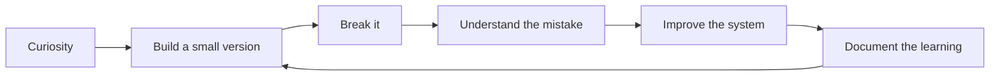

 

  

---

## 👋 About Me

Hi, I’m **Bishowdip Thapa**, a Software Engineering student at **Softwarica College of IT & E-commerce**, affiliated with **Coventry University**. I’m from **Kathmandu, Nepal**, and I’m the kind of learner who understands things best by building them, breaking them, fixing them, and trying again.

My path into software was not perfectly straight. Before fully moving into Software Engineering, I studied **Mechatronics, Robotics and Automation Engineering** at **Bauman Moscow State Technical University** in Russia. I eventually dropped out, but that chapter still shaped the way I think. It gave me an early interest in how machines, hardware, code, and intelligent systems connect with each other. Later, I found myself becoming more serious about programming, AI, and real-world software systems.

Right now, I’m building projects around **Explainable AI, Machine Learning, Computer Vision, Android development, OCR, and AI-media verification**. I do not want my GitHub to be only a collection of assignments or random practice projects. I want it to show my growth — from small desktop applications to systems that try to solve actual problems around healthcare, traffic, documents, and digital trust.

I’m still learning, still experimenting, and still far from where I want to be. But every commit here is part of that process. Some projects are clean, some are rough, and some are still becoming what I imagined. That is exactly the point of this profile: to show the journey, not just the final result.

> **My goal is simple: keep learning deeply, build honestly, and turn 0s and 1s into something useful.**

---

## 🧭 Current Direction

<table>
<tr>
<td width="50%" valign="top">

### 🧠 Explainable AI
I’m interested in AI systems that do more than produce outputs. I want models that can explain their reasoning clearly enough for people to question, trust, or reject them.

</td>
<td width="50%" valign="top">

### 👁️ Computer Vision
I’m exploring Nepal-specific traffic intelligence, including vehicle recognition, road scene understanding, helmet compliance, and practical traffic monitoring.

</td>
</tr>
<tr>
<td width="50%" valign="top">

### 📱 Application Development
I build Android and desktop applications using Kotlin, Java, Python, SQLite, and simple but practical architecture patterns.

</td>
<td width="50%" valign="top">

### 🛡️ Digital Trust
I’m curious about AI-generated media detection, image reuse, metadata analysis, OCR, and forensic-style tools that help people verify information.

</td>
</tr>
</table>

---

## 🛠️ Tech I Work With

### Languages

### AI, Data & ML

### App, Database & Tools

---

## 🚀 Featured Work

<table>
<tr>
<td width="50%" valign="top">

### 🇳🇵 [NepTraVision](https://github.com/bishowdip/NepTraVision)
A Nepal-focused traffic computer vision project exploring practical road intelligence such as vehicle counting, helmet compliance, and traffic-sign recognition.

`Python` `Computer Vision` `Traffic AI` `Nepal`

</td>
<td width="50%" valign="top">

### 🚦 [Nepal Traffic AI](https://github.com/bishowdip/Nepal_Traffic)
A vehicle recognition and traffic data collection project designed around the kind of road conditions seen in Nepal.

`Python` `AI` `Data Collection` `Traffic`

</td>
</tr>
<tr>
<td width="50%" valign="top">

### 🛡️ [SatarkAI](https://github.com/bishowdip/SatarkAI)
An AI-media forensic triage workstation for checking suspicious images, videos, metadata, and media authenticity signals.

`Python` `AI Forensics` `Verification` `Digital Trust`

</td>
<td width="50%" valign="top">

### ✍️ [Handwritten Form OCR](https://github.com/bishowdip/Handwritten-Form-OCR)
A system for extracting structured data from handwritten government or college forms and converting it into JSON/CSV.

`Python` `OCR` `Automation` `Data Extraction`

</td>
</tr>
<tr>
<td width="50%" valign="top">

### 🧠 [Medical AI Prediction System](https://github.com/bishowdip/medical-ai-prediction-system)
A multi-disease prediction system focused on explainability using SHAP and LIME, not just prediction accuracy.

`Python` `XAI` `Streamlit` `Healthcare AI`

</td>
<td width="50%" valign="top">

### 📱 [GharBato](https://github.com/ManjilDadaa/GharBato)
A collaborative Android application built with Kotlin, Gradle, and a team-based development workflow.

`Kotlin` `Android` `Gradle` `Team Project`

</td>
</tr>
<tr>
<td width="50%" valign="top">

### 🎯 [Quiz Application](https://github.com/bishowdip/QuizApplication)
A Java Swing desktop quiz platform with authentication, grading, leaderboard, and SQLite persistence.

`Java` `Swing` `SQLite` `MVC`

</td>
<td width="50%" valign="top">

### 💇 [Parlour Management System](https://github.com/bishowdip/Parlour_Management_System)
A desktop management system for salon services, appointments, billing, and records.

`Python` `Tkinter` `SQLite` `Desktop App`

</td>
</tr>
</table>

---

## 📈 GitHub Activity & Growth

  

  

  

 

---

## 🧩 How I Think About Building

I do not believe every project has to start perfectly. Most of my learning happens when something does not work the way I expected. That is where the debugging starts, and that is where the real understanding begins.

---

## 🎯 What I’m Learning Next

- Better machine learning evaluation and model explainability
- Computer vision pipelines for low-resource, real-world environments
- Android app architecture using Kotlin
- Clean Java/Python project structure
- OCR, metadata analysis, and AI-media verification workflows
- How to turn student projects into usable systems

---

## 🏆 Profile Highlights

---

## 💬 A Note to Anyone Visiting

This profile is still growing. Some repositories are polished, some are experimental, and some are part of my learning curve. But I try to keep building with one idea in mind: **software becomes meaningful when it connects with real problems.**

If you are also working on AI, computer vision, Android apps, OCR, Nepali datasets, or practical software for real-world problems, I would be happy to connect and learn together.

---

  

**From Kathmandu 🇳🇵 — building one commit at a time.**

